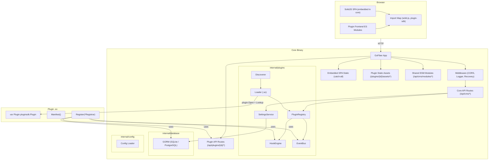
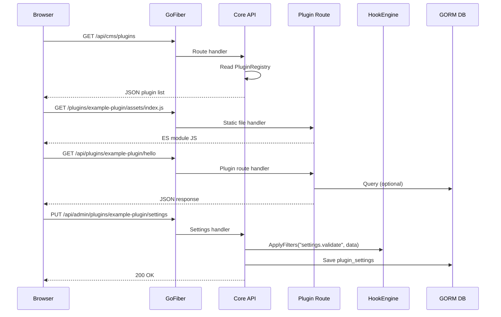
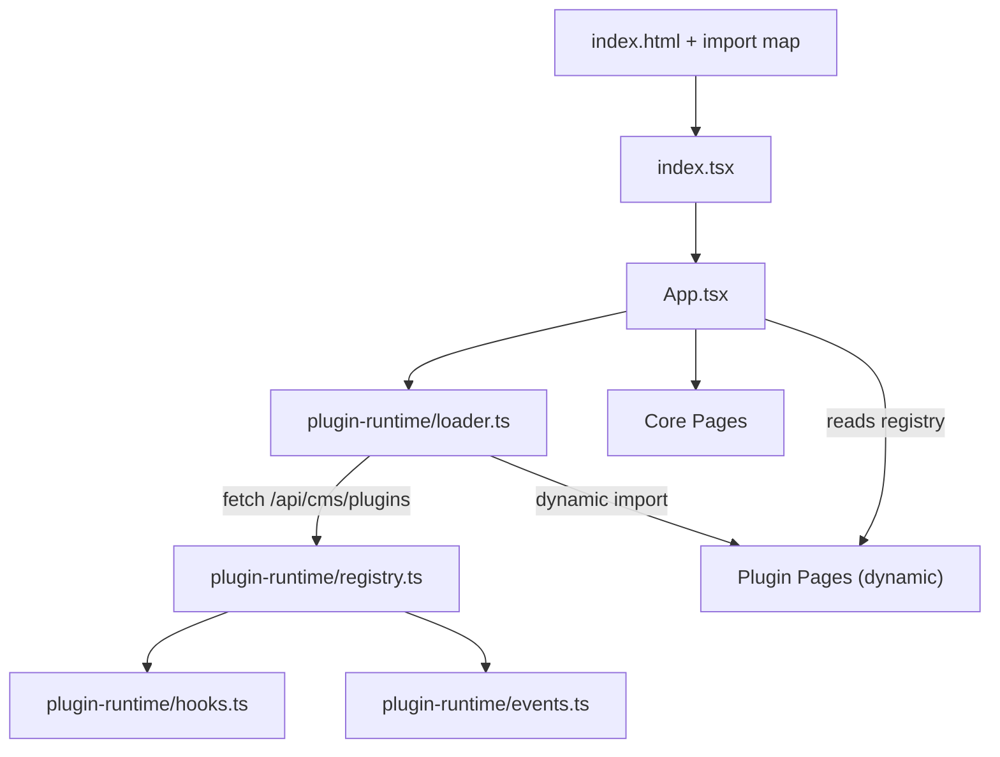

# BlitzPress CMS - Design Document

## Overview

BlitzPress is a Go monorepo CMS with four modules connected via `go.work`. The core loads `.so` plugins at runtime, exposes WordPress-style hooks, an async event bus, and serves an embedded SolidJS SPA that dynamically loads plugin frontends via ES module import maps. This design covers every component, interface, data model, and interaction needed to satisfy Requirements 1-16.

---

## Architecture

### High-Level System Diagram



### Request Flow



---

## Components and Interfaces

### 1. Plugin SDK Module (`plugin-sdk/`)

The SDK is a standalone Go module with **zero** dependencies on `core/internal`. It defines interfaces that `core` implements and plugins consume.

**File: `plugin-sdk/plugin.go`**

```go
package pluginsdk

import (
    "github.com/gofiber/fiber/v2"
    "gorm.io/gorm"
    "io/fs"
)

const SDKVersion = "0.1.0"

type Manifest struct {
    ID          string
    Name        string
    Version     string
    Description string
    Author      string
}

type Plugin interface {
    Manifest() Manifest
    Register(r *Registrar) error
}

type Registrar struct {
    Hooks    HookRegistry
    HTTP     HTTPRegistry
    Events   EventBus
    DB       *gorm.DB
    Settings SettingsRegistry
    Logger   Logger
    Config   ConfigReader
}
```

**File: `plugin-sdk/hooks.go`**

```go
package pluginsdk

type HookID string

type HookOptions struct {
    Priority int // default 10, lower = earlier
}

type HookContext struct {
    PluginID  string
    RequestID string
    Metadata  map[string]any
}

type ActionFunc func(ctx *HookContext, args ...any) error
type FilterFunc func(ctx *HookContext, value any, args ...any) (any, error)

type HookRegistry interface {
    AddAction(name string, fn ActionFunc, opts ...HookOptions) HookID
    DoAction(ctx *HookContext, name string, args ...any) error
    RemoveAction(name string, id HookID) bool

    AddFilter(name string, fn FilterFunc, opts ...HookOptions) HookID
    ApplyFilters(ctx *HookContext, name string, value any, args ...any) (any, error)
    RemoveFilter(name string, id HookID) bool
}
```

**File: `plugin-sdk/events.go`**

```go
package pluginsdk

import "github.com/dromara/carbon/v2"

type Event struct {
    Name      string
    PluginID  string
    Payload   map[string]any
    Timestamp carbon.DateTime
}

type EventHandler func(event Event) error

type EventBus interface {
    Publish(name string, payload map[string]any) error
    Subscribe(name string, handler EventHandler) string
    Unsubscribe(id string) bool
}
```

**File: `plugin-sdk/http.go`**

```go
package pluginsdk

import (
    "github.com/gofiber/fiber/v2"
    "io/fs"
)

type HTTPRegistry interface {
    API(fn func(router fiber.Router)) error
    Static(filesystem fs.FS, stripPrefix string) error
}
```

**File: `plugin-sdk/settings.go`**

```go
package pluginsdk

type SettingsSchema struct {
    Sections []SettingsSection
}

type SettingsSection struct {
    ID     string
    Title  string
    Fields []SettingsField
}

type SettingsField struct {
    ID          string
    Type        string // "string","text","number","boolean","select","color","url","email","custom"
    Label       string
    Description string
    Default     any
    Required    bool
    Min         *float64
    Max         *float64
    Options     []SelectOption // for "select" type
    Component   string         // for "custom" type: frontend component registry ID (e.g. "example-plugin.gradient-picker")
}

type SelectOption struct {
    Value string
    Label string
}

type SettingsRegistry interface {
    Register(schema SettingsSchema)
}

type ConfigReader interface {
    Get(key string) (string, error)
    GetInt(key string) (int, error)
    GetFloat(key string) (float64, error)
    GetBool(key string) (bool, error)
    GetAll() (map[string]any, error)
}
```

**File: `plugin-sdk/model.go`** -- See "Base Model (UUID v7)" section under Data Models.

**File: `plugin-sdk/context.go`**

```go
package pluginsdk

type Logger interface {
    Debug(msg string, args ...any)
    Info(msg string, args ...any)
    Warn(msg string, args ...any)
    Error(msg string, args ...any)
}

type MenuItem struct {
    ID    string
    Label string
    Icon  string
    Path  string
}
```

**File: `plugin-sdk/errors.go`**

```go
package pluginsdk

import "errors"

var (
    ErrManifestMismatch  = errors.New("plugin manifest does not match plugin.json")
    ErrIncompatibleSDK   = errors.New("plugin sdk_version is incompatible with host")
    ErrSymbolNotFound    = errors.New("exported Plugin symbol not found in .so")
    ErrInvalidManifest   = errors.New("plugin.json is missing or invalid")
    ErrRegistrationFailed = errors.New("plugin registration failed")
)
```

**Dependency direction:**
```
plugin-sdk  <--  core/internal/plugins (implements interfaces)
plugin-sdk  <--  example-plugin (consumes interfaces)
core  -X->  example-plugin (never)
example-plugin  -X->  core (never)
```

---

### 2. Core Plugin Subsystem (`core/internal/plugins/`)

#### 2.1 Discovery (`discover.go`)

Walks `build/plugins/`, reads each `plugin.json`, and returns a list of validated `PluginManifestFile` structs.

```go
type PluginManifestFile struct {
    SchemaVersion int      `json:"schema_version"`
    ID            string   `json:"id"`
    Name          string   `json:"name"`
    Version       string   `json:"version"`
    Description   string   `json:"description,omitempty"`
    Author        string   `json:"author,omitempty"`
    SDKVersion    string   `json:"sdk_version"`
    HasFrontend   bool     `json:"has_frontend"`
    FrontendEntry string   `json:"frontend_entry,omitempty"`
    FrontendStyle string   `json:"frontend_style,omitempty"`
    Capabilities  []string `json:"capabilities,omitempty"`
}

func Discover(pluginsDir string) ([]DiscoveredPlugin, []error)

type DiscoveredPlugin struct {
    ManifestFile PluginManifestFile
    Dir          string // absolute path to the plugin dir
    SOPath       string // absolute path to plugin.so
}
```

Validation rules:
- `schema_version` must be 1
- `id` must match `^[a-z0-9]+(-[a-z0-9]+)*$` (kebab-case)
- `name` and `version` must be non-empty
- `sdk_version` must be non-empty
- if `has_frontend`, `frontend_entry` must be non-empty
- `plugin.so` must exist in the directory

#### 2.2 Loader (`loader.go`)

Opens `.so` files, looks up the `Plugin` symbol, validates manifest consistency.

```go
func LoadPlugin(dp DiscoveredPlugin) (*LoadedPlugin, error)
```

Steps:
1. `plugin.Open(dp.SOPath)`
2. `sym, err := p.Lookup("Plugin")`
3. Cast to `*pluginsdk.Plugin`
4. Call `(*inst).Manifest()` and compare ID/Name/Version against `dp.ManifestFile`
5. Return `LoadedPlugin` with status `"loaded"` or error

#### 2.3 Registry (`registry.go`)

Central store for all loaded plugins. Thread-safe via `sync.RWMutex`.

```go
type LoadedPlugin struct {
    Manifest      pluginsdk.Manifest
    ManifestFile  PluginManifestFile
    Path          string
    Instance      pluginsdk.Plugin
    Status        string // "loaded", "error", "disabled"
    Errors        []error
    Routes        []registeredRoute   // collected during Register()
    StaticFS      []registeredStatic  // collected during Register()
    SettingsSchema *pluginsdk.SettingsSchema
}

type PluginRegistry struct {
    plugins map[string]*LoadedPlugin
    hooks   *HookEngine
    events  *EventBusImpl
    mu      sync.RWMutex
    logger  *slog.Logger
    db      *gorm.DB
}

func NewPluginRegistry(db *gorm.DB, logger *slog.Logger) *PluginRegistry
func (r *PluginRegistry) DiscoverAndLoad(pluginsDir string) error
func (r *PluginRegistry) GetPlugin(id string) (*LoadedPlugin, bool)
func (r *PluginRegistry) ListPlugins() []*LoadedPlugin
func (r *PluginRegistry) MountRoutes(api fiber.Router, root fiber.Router)
```

`DiscoverAndLoad` orchestrates the full lifecycle:
1. Call `Discover(pluginsDir)`
2. For each discovered plugin, call `LoadPlugin()`
3. Build a per-plugin `Registrar` with scoped `HTTPRegistry` and `ConfigReader`
4. Call `plugin.Register(registrar)` -- route/hook/event registrations are captured
5. Store in registry map
6. Fire `plugin.loaded` action for each
7. After all done, fire `core.ready`

#### 2.4 Hook Engine (`hooks.go`)

Implements `pluginsdk.HookRegistry`. Stores hooks in sorted slices per hook name.

```go
type hookEntry struct {
    id       pluginsdk.HookID
    priority int
    order    int // registration sequence for stable sort
    pluginID string
}

type actionEntry struct {
    hookEntry
    fn pluginsdk.ActionFunc
}

type filterEntry struct {
    hookEntry
    fn pluginsdk.FilterFunc
}

type HookEngine struct {
    actions  map[string][]actionEntry  // hook name -> sorted slice
    filters  map[string][]filterEntry
    mu       sync.RWMutex
    nextID   atomic.Uint64
}
```

- `AddAction`/`AddFilter`: append to slice, re-sort by (priority, order)
- `DoAction`: iterate sorted slice, call each fn, collect errors
- `ApplyFilters`: iterate sorted slice, chain value through each fn
- `RemoveAction`/`RemoveFilter`: find by HookID, splice out
- HookID format: `"hook_{counter}"` using atomic counter

#### 2.5 Event Bus (`eventbus.go`)

Implements `pluginsdk.EventBus`. Async processing via buffered channel + worker goroutines.

```go
type subscription struct {
    id       string
    name     string
    handler  pluginsdk.EventHandler
    pluginID string
}

type EventBusImpl struct {
    subs     map[string][]subscription // event name -> handlers
    mu       sync.RWMutex
    ch       chan pluginsdk.Event
    logger   *slog.Logger
    wg       sync.WaitGroup
    done     chan struct{}
}

func NewEventBus(logger *slog.Logger, workerCount int, bufferSize int) *EventBusImpl
func (eb *EventBusImpl) Start()
func (eb *EventBusImpl) Stop()
```

- `Publish`: creates `Event` with timestamp, sends to buffered channel, returns immediately
- Workers read from channel, fan out to matching subscribers
- Failed handlers are logged, never propagated
- `Stop()` closes done channel, drains remaining events, waits on WaitGroup
- Default: 4 workers, buffer size 256

#### 2.6 HTTP Mount (`http.go`)

Implements `pluginsdk.HTTPRegistry` scoped per plugin. Collects route registrations during `Register()`, mounts them after.

```go
type pluginHTTPRegistry struct {
    pluginID string
    routes   []func(fiber.Router) // collected API route fns
    statics  []staticMount        // collected static FS mounts
}

type staticMount struct {
    fs          fs.FS
    stripPrefix string
}

func (h *pluginHTTPRegistry) API(fn func(router fiber.Router)) error
func (h *pluginHTTPRegistry) Static(filesystem fs.FS, stripPrefix string) error
```

At mount time (called by registry after all plugins registered):
```go
// For each loaded plugin:
pluginAPIGroup := apiRouter.Group("/plugins/" + pluginID)
for _, routeFn := range plugin.Routes {
    routeFn(pluginAPIGroup)
}

pluginStaticGroup := rootRouter.Group("/plugins/" + pluginID + "/assets")
for _, sm := range plugin.Statics {
    subFS, _ := fs.Sub(sm.fs, sm.stripPrefix)
    pluginStaticGroup.Use("/", filesystem.New(filesystem.Config{
        Root: http.FS(subFS),
    }))
}
```

#### 2.7 Settings Service (`settings.go`)

Implements `pluginsdk.SettingsRegistry` and `pluginsdk.ConfigReader` per plugin.

```go
type pluginSettingsRegistry struct {
    pluginID string
    schema   *pluginsdk.SettingsSchema
}

func (s *pluginSettingsRegistry) Register(schema pluginsdk.SettingsSchema)

type pluginConfigReader struct {
    pluginID string
    db       *gorm.DB
}

func (c *pluginConfigReader) Get(key string) (string, error)
func (c *pluginConfigReader) GetInt(key string) (int, error)
func (c *pluginConfigReader) GetFloat(key string) (float64, error)
func (c *pluginConfigReader) GetBool(key string) (bool, error)
func (c *pluginConfigReader) GetAll() (map[string]any, error)
```

Core exposes two API handlers registered in `main.go`:
- `GET /api/admin/plugins/:id/settings` -- returns `{ schema, values }`
- `PUT /api/admin/plugins/:id/settings` -- validates against schema, saves to DB

---

### 3. Database Layer (`core/internal/database/`)

**File: `database.go`**

```go
package database

import (
    "gorm.io/gorm"
    "gorm.io/driver/sqlite"
    "gorm.io/driver/postgres"
)

type Config struct {
    Driver string // "sqlite" or "postgres"
    DSN    string // file path or connection string
}

func Initialize(cfg Config) (*gorm.DB, error) {
    var dialector gorm.Dialector
    switch cfg.Driver {
    case "postgres":
        dialector = postgres.Open(cfg.DSN)
    default:
        dialector = sqlite.Open(cfg.DSN)
    }
    db, err := gorm.Open(dialector, &gorm.Config{})
    if err != nil {
        return nil, err
    }
    return db, db.AutoMigrate(
        &User{},
        &Setting{},
        &PluginState{},
        &PluginSetting{},
    )
}
```

---

### 4. Configuration (`core/internal/config/`)

**File: `config.go`**

```go
package config

import "os"

type AppConfig struct {
    Port       string // default ":3000"
    DBDriver   string // "sqlite" or "postgres"
    DBDSN      string // default "blitzpress.db"
    PluginsDir string // default "../build/plugins" (relative to binary) or absolute
    LogLevel   string // "debug", "info", "warn", "error"
}

func Load() *AppConfig
```

Reads from environment variables with `BLITZPRESS_` prefix:
- `BLITZPRESS_PORT`, `BLITZPRESS_DB_DRIVER`, `BLITZPRESS_DB_DSN`, `BLITZPRESS_PLUGINS_DIR`, `BLITZPRESS_LOG_LEVEL`

Falls back to sensible defaults for local dev.

---

### 5. Core Entrypoint (`core/main.go`)

```go
func main() {
    // 1. Load config
    cfg := config.Load()

    // 2. Initialize logger (slog)
    logger := slog.New(slog.NewTextHandler(os.Stdout, &slog.HandlerOptions{Level: parseLevel(cfg.LogLevel)}))

    // 3. Initialize database
    db, err := database.Initialize(database.Config{Driver: cfg.DBDriver, DSN: cfg.DBDSN})

    // 4. Create Fiber app
    app := fiber.New(fiber.Config{...})

    // 5. Core middleware
    app.Use(cors.New())
    app.Use(fiberlogger.New())
    app.Use(recover.New())

    // 6. Initialize plugin registry
    registry := plugins.NewPluginRegistry(db, logger)

    // 7. Fire core.booting
    registry.Hooks().DoAction(&pluginsdk.HookContext{}, "core.booting")

    // 8. Discover & load plugins
    registry.DiscoverAndLoad(cfg.PluginsDir)

    // 9. Mount plugin routes
    api := app.Group("/api")
    registry.MountRoutes(api, app)

    // 10. Core API routes
    api.Get("/cms/plugins", cmsPluginsHandler(registry))
    api.Get("/cms/modules/*", cmsModulesHandler()) // serve shared ESM
    api.Get("/admin/plugins/:id/settings", settingsGetHandler(registry))
    api.Put("/admin/plugins/:id/settings", settingsPutHandler(registry, db))

    // 11. Embedded SPA catch-all
    app.Use("/", filesystem.New(filesystem.Config{
        Root:       http.FS(staticFS),
        PathPrefix: "static",
        Index:      "index.html",
    }))
    // SPA fallback: serve index.html for all unmatched routes
    app.Use(spaFallback(staticFS))

    // 12. Fire core.ready
    registry.Hooks().DoAction(&pluginsdk.HookContext{}, "core.ready")

    // 13. Graceful shutdown
    go func() {
        sigCh := make(chan os.Signal, 1)
        signal.Notify(sigCh, syscall.SIGINT, syscall.SIGTERM)
        <-sigCh
        registry.Hooks().DoAction(&pluginsdk.HookContext{}, "core.shutdown")
        registry.EventBus().Stop()
        app.Shutdown()
    }()

    // 14. Listen
    app.Listen(cfg.Port)
}
```

### Import Map Injection

The Go backend injects the import map into the embedded `index.html` before serving it. The `spaFallback` handler reads the embedded `index.html`, injects the `<script type="importmap">` block with paths to `/api/cms/modules/*`, and caches the result.

The `/api/cms/modules/*` route serves pre-built ESM wrappers of `solid-js`, `solid-js/web`, `solid-js/store`, and the frontend plugin SDK. These files are built as part of the core frontend build step and embedded alongside the SPA.

---

## Data Models

### Base Model (UUID v7)

All models use UUID v7 as primary key instead of auto-incrementing integers. UUID v7 is time-ordered (sortable), globally unique, and safe for distributed systems.

The SDK exports a `BaseModel` that all core and plugin models should embed:

```go
// plugin-sdk/model.go

import (
    "github.com/dromara/carbon/v2"
    "github.com/google/uuid"
    "gorm.io/gorm"
)

// BaseModel replaces gorm.Model with UUID v7 primary key and Carbon datetime fields.
// All core and plugin database models MUST embed this instead of gorm.Model.
type BaseModel struct {
    ID        uuid.UUID       `gorm:"type:char(36);primaryKey"`
    CreatedAt carbon.DateTime `gorm:"autoCreateTime"`
    UpdatedAt carbon.DateTime `gorm:"autoUpdateTime"`
    DeletedAt gorm.DeletedAt  `gorm:"index"`
}

func (b *BaseModel) BeforeCreate(tx *gorm.DB) error {
    if b.ID == uuid.Nil {
        b.ID = uuid.Must(uuid.NewV7())
    }
    return nil
}
```

**Libraries:**
- `github.com/google/uuid` (v1.6+) for `uuid.NewV7()` (RFC 9562, time-ordered)
- `github.com/dromara/carbon/v2` for datetime handling -- `carbon.DateTime` implements `database/sql` `Scanner`/`Valuer` interfaces and is fully GORM-compatible. It replaces `time.Time` throughout all models and provides a rich, developer-friendly datetime API (formatting, diffing, comparison, timezone handling, etc.)

All datetime fields across all models (core and plugin) use `carbon.DateTime` instead of `time.Time`. The Event struct also uses `carbon.DateTime`.

### Core Database Models

```go
// core/internal/database/models.go

type User struct {
    pluginsdk.BaseModel
    Email    string `gorm:"uniqueIndex;not null"`
    Password string `gorm:"not null"` // bcrypt hash
    Role     string `gorm:"default:'admin'"`
}

type Setting struct {
    pluginsdk.BaseModel
    Key   string `gorm:"uniqueIndex;not null"`
    Value string `gorm:"type:text"`
}

type PluginState struct {
    pluginsdk.BaseModel
    PluginID string `gorm:"uniqueIndex;not null"`
    Enabled  bool   `gorm:"default:true"`
    Version  string
}

type PluginSetting struct {
    pluginsdk.BaseModel
    PluginID string `gorm:"index;not null"`
    Key      string `gorm:"not null"`
    Value    string `gorm:"type:text"` // JSON-encoded value
}
```

Composite unique index on `PluginSetting`: `(plugin_id, key)`.

Plugin models must also embed `pluginsdk.BaseModel`:
```go
// example: inside a plugin
type ExamplePluginItem struct {
    pluginsdk.BaseModel
    Title string
    Body  string
}
```

### Plugin Manifest JSON Schema

```json
{
    "$schema": "http://json-schema.org/draft-07/schema#",
    "type": "object",
    "required": ["schema_version", "id", "name", "version", "sdk_version"],
    "properties": {
        "schema_version": { "type": "integer", "const": 1 },
        "id": { "type": "string", "pattern": "^[a-z0-9]+(-[a-z0-9]+)*$" },
        "name": { "type": "string", "minLength": 1 },
        "version": { "type": "string", "pattern": "^\\d+\\.\\d+\\.\\d+$" },
        "sdk_version": { "type": "string", "pattern": "^\\d+\\.\\d+\\.\\d+$" },
        "description": { "type": "string" },
        "author": { "type": "string" },
        "has_frontend": { "type": "boolean", "default": false },
        "frontend_entry": { "type": "string" },
        "frontend_style": { "type": "string" },
        "capabilities": { "type": "array", "items": { "type": "string" } }
    }
}
```

---

## Frontend Architecture

### Core SolidJS App (`core/frontend/`)



### Frontend Plugin Runtime Types (`plugin-runtime/types.ts`)

```ts
export interface PluginManifest {
    id: string;
    name: string;
}

export interface PageDefinition {
    id: string;
    path: string;
    title: string;
    component: () => Promise<{ default: Component }>;
}

export interface WidgetDefinition {
    id: string;
    title: string;
    component: () => Promise<{ default: Component }>;
}

export interface FrontendRegistrar {
    pages: { add(page: PageDefinition): void };
    widgets: { add(widget: WidgetDefinition): void };
    hooks: FrontendHookEngine;
    events: FrontendEventBus;
    settings: {
        setCustomComponent(loader: () => Promise<{ default: Component }>): void;
        addFieldComponent(id: string, component: Component<{ value: any; onChange: (value: any) => void }>): void;
    };
}

export interface FrontendHookEngine {
    addAction(name: string, fn: (...args: any[]) => void, opts?: { priority?: number }): string;
    addFilter<T>(name: string, fn: (value: T, ...args: any[]) => T, opts?: { priority?: number }): string;
    doAction(name: string, ...args: any[]): void;
    applyFilters<T>(name: string, value: T, ...args: any[]): T;
    removeAction(name: string, id: string): boolean;
    removeFilter(name: string, id: string): boolean;
}

export interface FrontendEventBus {
    publish(name: string, payload: any): void;
    subscribe(name: string, handler: (event: { name: string; payload: any }) => void): string;
    unsubscribe(id: string): boolean;
}
```

### Plugin Registry (`plugin-runtime/registry.ts`)

Stores all registrations from plugins. SolidJS signals/stores make UI reactively update when plugins register pages/widgets.

```ts
import { createStore } from "solid-js/store";

const [state, setState] = createStore({
    pages: [] as PageDefinition[],
    widgets: [] as WidgetDefinition[],
    settingsComponents: {} as Record<string, () => Promise<{ default: Component }>>,
    fieldComponents: {} as Record<string, Component<{ value: any; onChange: (v: any) => void }>>,
});

export function createRegistrar(manifest: PluginManifest): FrontendRegistrar {
    return {
        pages: {
            add(page) { setState("pages", (prev) => [...prev, page]); },
        },
        widgets: {
            add(widget) { setState("widgets", (prev) => [...prev, widget]); },
        },
        hooks: hookEngine,
        events: eventBus,
        settings: {
            setCustomComponent(loader) {
                setState("settingsComponents", manifest.id, loader);
            },
            addFieldComponent(id, component) {
                setState("fieldComponents", id, component);
            },
        },
    };
}

export function registerPlugin(
    manifest: PluginManifest,
    registerFn: (registrar: FrontendRegistrar) => void
) {
    const registrar = createRegistrar(manifest);
    registerFn(registrar);
}
```

### Frontend Hook Engine (`plugin-runtime/hooks.ts`)

Same sorted-priority model as backend:

```ts
type HookEntry = { id: string; priority: number; order: number; fn: Function };

class HookEngineImpl implements FrontendHookEngine {
    private actions = new Map<string, HookEntry[]>();
    private filters = new Map<string, HookEntry[]>();
    private counter = 0;

    addAction(name, fn, opts?) { /* append, sort by priority/order, return id */ }
    addFilter(name, fn, opts?) { /* same */ }
    doAction(name, ...args) { /* iterate sorted, call each */ }
    applyFilters(name, value, ...args) { /* chain value through sorted fns */ }
    removeAction(name, id) { /* splice by id */ }
    removeFilter(name, id) { /* splice by id */ }
}
```

### Frontend Event Bus (`plugin-runtime/events.ts`)

Simple pub/sub, all synchronous in browser (microtask queue via `queueMicrotask`):

```ts
class EventBusImpl implements FrontendEventBus {
    private subs = new Map<string, { id: string; handler: Function }[]>();
    private counter = 0;

    publish(name, payload) {
        const handlers = this.subs.get(name) || [];
        for (const sub of handlers) {
            queueMicrotask(() => sub.handler({ name, payload }));
        }
    }
    subscribe(name, handler) { /* add to map, return id */ }
    unsubscribe(id) { /* remove from map */ }
}
```

### Plugin Loader (`plugin-runtime/loader.ts`)

```ts
export async function loadPlugins() {
    const res = await fetch("/api/cms/plugins");
    const { plugins } = await res.json();

    for (const plugin of plugins) {
        if (!plugin.has_frontend) continue;

        if (plugin.frontend_style) {
            const link = document.createElement("link");
            link.rel = "stylesheet";
            link.href = plugin.frontend_style;
            document.head.appendChild(link);
        }

        try {
            await import(/* @vite-ignore */ plugin.frontend_entry);
        } catch (err) {
            console.error(`Failed to load plugin frontend: ${plugin.id}`, err);
        }
    }
}
```

### Shared ESM Modules Strategy

The core frontend Vite build produces additional ESM wrapper files that re-export SolidJS:

```
core/frontend/src/modules/
  solid-js.ts        -> export * from "solid-js"
  solid-js-web.ts    -> export * from "solid-js/web"
  solid-js-store.ts  -> export * from "solid-js/store"
  plugin-sdk.ts      -> export { registerPlugin, hooks, ... }
```

These are built with a separate Vite config entry that outputs ES modules into `core/static/modules/`. The Go backend serves them at `/api/cms/modules/*`. The import map in `index.html` points to these URLs.

This guarantees a single SolidJS instance across core and all plugins.

---

## `@blitzpress/vite-plugin` Package

**Location:** `core/frontend/packages/vite-plugin/`

```ts
// src/index.ts
import type { Plugin } from "vite";

interface BlitzPressPluginOptions {
    pluginId: string;
}

export default function blitzpressPlugin(opts: BlitzPressPluginOptions): Plugin {
    return {
        name: "blitzpress-plugin",
        config() {
            return {
                build: {
                    lib: {
                        entry: "src/index.ts",
                        formats: ["es"],
                        fileName: "index",
                    },
                    outDir: "dist",
                    rollupOptions: {
                        external: [
                            "solid-js",
                            "solid-js/web",
                            "solid-js/store",
                            "@blitzpress/plugin-sdk",
                        ],
                    },
                },
            };
        },
    };
}
```

Published as `@blitzpress/vite-plugin` via the monorepo workspace. Plugin authors use it in their `vite.config.ts`.

---

## API Endpoints Summary

| Method | Path | Purpose | Req |
|--------|------|---------|-----|
| GET | `/api/cms/plugins` | List loaded plugins with frontend info | 8.3, 10.3 |
| GET | `/api/cms/modules/:name` | Serve shared ESM modules (solid-js, plugin-sdk) | 10.1, 10.2 |
| GET | `/api/admin/plugins/:id/settings` | Get plugin settings schema + current values | 12.5 |
| PUT | `/api/admin/plugins/:id/settings` | Save plugin settings (validated) | 12.5 |
| * | `/api/plugins/:id/*` | Plugin-registered API routes | 7.1, 7.2 |
| GET | `/plugins/:id/assets/*` | Plugin static/frontend assets | 7.3, 7.4 |
| GET | `/*` | SPA catch-all (embedded index.html) | 8.2 |

---

## Error Handling

### Backend

- **Plugin discovery errors**: logged + plugin skipped, other plugins continue loading
- **Plugin load errors** (`.so` open/symbol lookup): logged, status set to `"error"`, stored in `LoadedPlugin.Errors`
- **Manifest mismatch**: `pluginsdk.ErrManifestMismatch`, plugin rejected
- **SDK incompatibility**: `pluginsdk.ErrIncompatibleSDK`, plugin rejected
- **Hook execution errors**: `DoAction` collects all errors and returns joined error; `ApplyFilters` stops pipeline on first error and returns it
- **Event bus handler errors**: logged, never propagated to publisher
- **Settings validation errors**: 400 response with field-level error messages

### Frontend

- **Plugin load failure**: `console.error`, other plugins continue loading
- **Hook execution errors**: caught per-callback, logged, never propagated
- **Event bus errors**: caught per-handler, logged

---

## Testing Strategy

### Unit Tests

| Component | Test Focus |
|-----------|-----------|
| `HookEngine` | Priority ordering, registration/removal, DoAction/ApplyFilters chaining, concurrent access |
| `EventBusImpl` | Publish/subscribe, async delivery, handler failure isolation, stop/drain |
| `Discover` | Valid/invalid manifests, missing files, kebab-case validation |
| `Loader` | Symbol lookup (mock with test plugin), manifest mismatch detection |
| `PluginRegistry` | Full lifecycle, concurrent access, error accumulation |
| `pluginConfigReader` | Get/GetInt/GetBool with various stored values |
| `Settings validation` | Field types, required fields, min/max, select options |
| Frontend `HookEngine` | Same as backend: priority, chaining, removal |
| Frontend `Registry` | Page/widget registration, store reactivity |

### Integration Tests

- Build example-plugin `.so`, load it in a test core instance, verify routes respond
- Settings round-trip: register schema, PUT values, GET them back
- Hook pipeline: register filters from multiple "plugins", verify chaining order

### Build Verification

- `scripts/build-all.sh` runs in CI
- Verify `build/` output structure matches expected layout
- Verify core binary starts and responds to health check

---

## Build and Dev Workflow

### Development (two terminals)

**Terminal 1 -- Core:**
```bash
air -c .air.toml
```

**Terminal 2 -- Plugin:**
```bash
air -c example-plugin/.air.toml
```

Core's air watches `build/plugins/**/*.so` and restarts when plugin rebuilds.

### Production Build

```bash
./scripts/build-all.sh
# Output: build/blitzpress + build/plugins/example-plugin/
```

### Air Config Key Details

Core `.air.toml`:
- `cmd`: builds frontend, copies to `static/`, builds Go binary
- `bin`: `./build/blitzpress`
- `include_file`: `["build/plugins/**/*.so"]` -- triggers restart on plugin changes

Plugin `.air.toml`:
- `cmd`: builds frontend, copies assets + manifest to `build/plugins/{id}/`, builds `.so`
- `bin`: `echo done && sleep` / `args_bin: ["infinity"]` -- no persistent process
- `include_ext`: `["go", "ts", "tsx", "css"]`

---

## Manager CLI (`manager/`)

Minimal initial implementation using Go `flag` or `cobra`.

```go
// manager/main.go

func main() {
    if len(os.Args) < 2 {
        printUsage()
        os.Exit(1)
    }

    switch os.Args[1] {
    case "list":
        cmdList()
    case "build":
        cmdBuild(os.Args[2:])
    default:
        printUsage()
        os.Exit(1)
    }
}

func cmdList() {
    // Walk build/plugins/, read each plugin.json, print table
}

func cmdBuild(args []string) {
    // Validate plugin dir exists + has plugin.json
    // Run: bun install && bun run build (if has frontend/)
    // mkdir -p build/plugins/{id}/
    // cp plugin.json, frontend assets
    // go build -buildmode=plugin -o build/plugins/{id}/plugin.so
}
```

---

## Security Design Notes

- Plugins run in-process -- no sandboxing (trust model, same as WordPress)
- Route isolation enforced by prefix: plugins cannot register at `/api/cms/*` or `/api/admin/*` 
- Settings API at `/api/admin/*` will need auth middleware (not in initial scope but the route prefix is reserved)
- DB access is unrestricted -- convention-based table prefixing
- Frontend plugins share the DOM -- same trust model as backend
- Future: plugin signing via checksums.txt + public key verification
