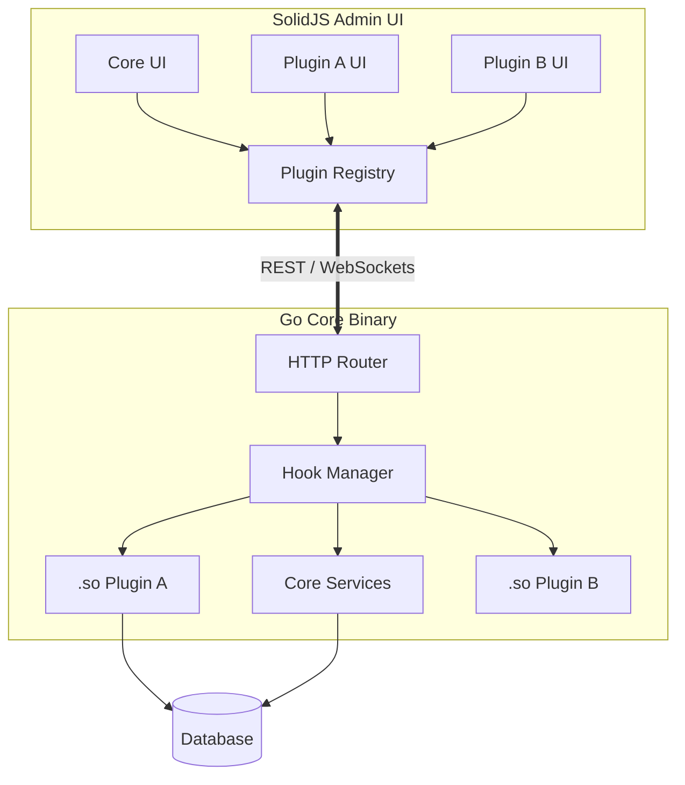

# BlitzPress: Custom Page Experience Plan

Based on premium UI/UX principles (editorial design, minimalism, single focal points, and massive whitespace), we are ditching the generic template approach. Every page will serve a specific narrative purpose with a bespoke layout, interactive illustrations, and targeted animations.

---

## 1. Why BlitzPress (`/why-blitzpress`)
**Theme:** The Manifesto (Editorial & Typography-First)
**Vibe:** Reading a high-end tech magazine. Bold claims, stark contrasts.

*   **Layout:** Sticky Split-Screen.
    *   **Left Column (Sticky):** Massive typography (`text-hero`). Just one powerful statement: *"The legacy CMS model is broken. We rebuilt it for Go."*
    *   **Right Column (Scrolls):** A series of arguments (The Gap vs. The Answer) with massive whitespace (`py-28`) between them.
*   **Illustrations (SVG):**
    *   *The Problem:* An animated SVG of tangled, chaotic wires (representing legacy PHP/hooks) that vibrates and looks fragile.
    *   *The Solution:* As the user scrolls to "The Answer", the wires snap into a clean, rigid, glowing geometric grid representing Go's typed contracts.
*   **Animations:** Scroll-triggered text reveals (lines fading in from bottom to top).

---

## 2. Features (`/features`)
**Theme:** The Bento Box (Interactive Technical Showcase)
**Vibe:** Modern SaaS, highly interactive, "show, don't tell".

*   **Layout:** Asymmetrical Bento Grid. Not a boring 3x3 grid. 
    *   One massive hero card taking up 70% of the viewport showcasing the **Go-first CMS runtime**.
    *   Smaller supporting cards around it.
*   **Illustrations & Interaction:**
    *   **Interactive Micro-Widgets:** The "Dynamic SolidJS Admin" card isn't an image; it's a mini, functional UI component. Users can click a toggle switch inside the card, and the card's background instantly re-renders without a page load, proving the framework's speed.
    *   **Hover States:** When hovering over the "Compiled Plugin" card, the glassmorphism surface fades away to reveal the raw Go code (`package main...`) running underneath.

---

## 3. Plugin System (`/plugin-system`)
**Theme:** The Assembly Line (Horizontal Journey)
**Vibe:** Industrial, precise, compiled.

*   **Layout:** Horizontal Scroll Section. The user scrolls down, but the page moves sideways, taking them through the lifecycle of a plugin.
*   **Illustrations (SVG/CSS):**
    *   **Step 1 (Code):** A glowing text editor typing Go code.
    *   **Step 2 (Compile):** An SVG anvil/press stamping the code into a `.so` file.
    *   **Step 3 (Load):** The `.so` file sliding into a slot in the "Core Binary" block.
    *   **Step 4 (UI):** A SolidJS dashboard instantly lighting up with a new widget.
*   **Animations:** Seamless GSAP/ScrollTrigger animations tracking the `.so` file across the screen as the user scrolls.

---

## 4. Admin Experience (`/admin-experience`)
**Theme:** The Product Illusion (Immersive UI)
**Vibe:** You are already inside the app.

*   **Layout:** Full-bleed, edge-to-edge browser window mockup. No traditional headers/footers in the viewport initially.
*   **Illustrations:** A highly detailed, interactive CSS mockup of the BlitzPress admin panel.
*   **Interaction ("Guided Tour"):** 
    *   Pulsing hotspots appear on the UI (e.g., on a custom plugin widget, on the nav bar).
    *   Clicking a hotspot dims the rest of the UI and brings up a sleek side-panel showing the exact Go and SolidJS code required to render that specific piece of the admin.

---

## 5. Developer Experience (`/developer-experience`)
**Theme:** Terminal First (Dark Mode IDE)
**Vibe:** Built by developers, for developers. Monospace fonts, dark backgrounds.

*   **Layout:** Side-by-side IDE view.
    *   **Left Pane:** `backend.go`
    *   **Right Pane:** `frontend.tsx`
    *   **Bottom Pane:** Terminal emulator.
*   **Illustrations:**
    *   Live typing animation in the terminal: `go build -buildmode=plugin -o myplugin.so`.
    *   Once the "command" finishes, a glowing connection line (SVG dash-array) shoots from the Go pane to the TSX pane, illustrating the shared types/contracts.
*   **Animations:** Syntax highlighting fading in. Code lines highlighting sequentially to explain the data flow.

---

## 6. Architecture (`/architecture`)
**Theme:** The Blueprint (Deep Dive)
**Vibe:** Engineering schematic, highly detailed but explorable.

*   **Layout:** Immersive, zoomable canvas (Pan & Zoom).
*   **Illustrations:** A comprehensive Mermaid.js diagram or custom SVG graph.

*   **Interaction:** Clicking on any node in the diagram expands it into a detailed specification card with code contracts and latency metrics.

---

## 7. Roadmap (`/roadmap`)
**Theme:** The Living Journey
**Vibe:** Transparent, forward-moving, dynamic.

*   **Layout:** A central, winding vertical SVG path down the center of the page.
*   **Illustrations:** 
    *   **Past Milestones:** Solid glowing emerald nodes.
    *   **Current Focus:** A pulsing, animated node with a radar sweep effect.
    *   **Future:** Dashed outlines that look like blueprints.
*   **Animations:** The main SVG path "draws" itself downward exactly matching the user's scroll position.

---

## 8. Get Started (`/get-started`)
**Theme:** The Launchpad
**Vibe:** Zero friction, action-oriented.

*   **Layout:** Focused, distraction-free wizard centered on the screen. Massive whitespace all around.
*   **Illustrations:** An interactive CLI prompt. 
*   **Interaction:** 
    *   Instead of static text to copy, the user clicks "Simulate Install".
    *   The terminal runs a fake installation process showing logs (`Downloading core...`, `Building SolidJS admin...`).
    *   When it hits 100%, the terminal morphs into a glowing "Success" card with the next steps (`cd blitzpress && ./scripts/build-all.sh`).

---

## Global Design Tokens & Rules Applied
- **Whitespace:** Minimum `112px` (`py-28`) between all major sections. No cramped content.
- **Typography:** Using custom `text-hero`, `text-section` tokens. Only one `h1` per page, massive and bold.
- **Colors:** Deep dark mode (`bg-[#0a0f1c]`) with Emerald/Indigo accents. No generic AI purple gradients.
- **Images/SVGs:** Taking up 70%+ of their containers. Text is secondary to the visual proof.